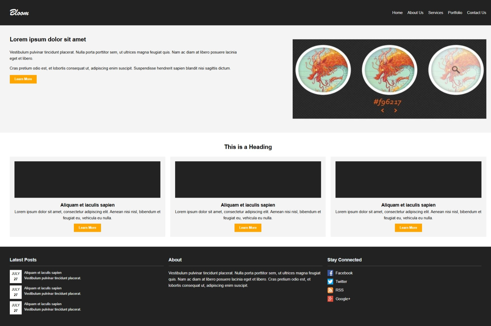
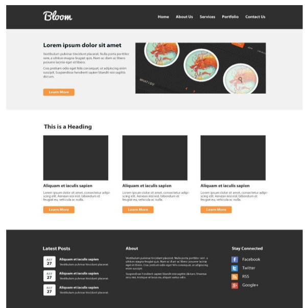

# Bloom Website Clone (Static Version)

## 📌 Project Overview
This project is a static recreation of the Bloom single-page website layout using only **HTML** and **CSS**. The purpose of the project is to clone the visual layout of the given screenshot, maintaining a professional structure using semantic HTML and clean CSS styling.

---

## 🧩 Technology Stack
- HTML
- CSS3

---

## 📄 Layout Sections Implemented

1. **Navigation Bar** – Includes logo and menu.
2. **Hero Section** – Includes heading, text content, and an image.
3. **Services/Portfolio Section** – Three styled cards with titles, text, and buttons.
4. **Footer Section** – Divided into:
   - Latest Posts (with dates)
   - About info
   - Social media links

---

## ✔️ Project Constraints Followed
- ❌ No JavaScript or frameworks (e.g., Bootstrap).
- ✅ Only semantic HTML and plain CSS used.
- ✅ Used placeholder images in place of original visuals.
- ✅ Layout, color scheme, spacing, and structure closely match the reference.

---

## 💡 Assumptions & Simplifications
- As actual assets weren’t provided, placeholder images (`via.placeholder.com`) are used.
- Decorative fonts such as `'Brush Script MT'` are assumed to be system-available.
- Social media icons are simulated using placeholder images for demonstration.

---

## ⚙️ Features
- Clean, semantic HTML layout.
- CSS Flexbox used for responsive layout.
- Added hover effects for buttons and menu items (bonus).
- Responsive behavior for screen widths below 768px (bonus).

---

## 📸 Screenshots

### 🔹 Cloned Version
_Provide a screenshot like below after opening `index.html` in a browser and capturing the full view:_

---

### 🔹 Reference Screenshot (Provided by Mentor)
_Include the original screenshot provided (if available) or a mock image for submission._

---

## 🙌 Challenges Faced
- Adjusting the hero image responsiveness using `flex` and `max-width`.
- Correct spacing/alignment across different screen sizes.
- Ensuring semantic structure while retaining the visual hierarchy.

---

## 📁 Folder Structure

project-folder/
│
├── index.html
├── style.css
├── README.md
├── screenshots/
│ ├── bloom-clone.png
│ └── bloom-original.png
└── assets

**J FENINA REXIN**

